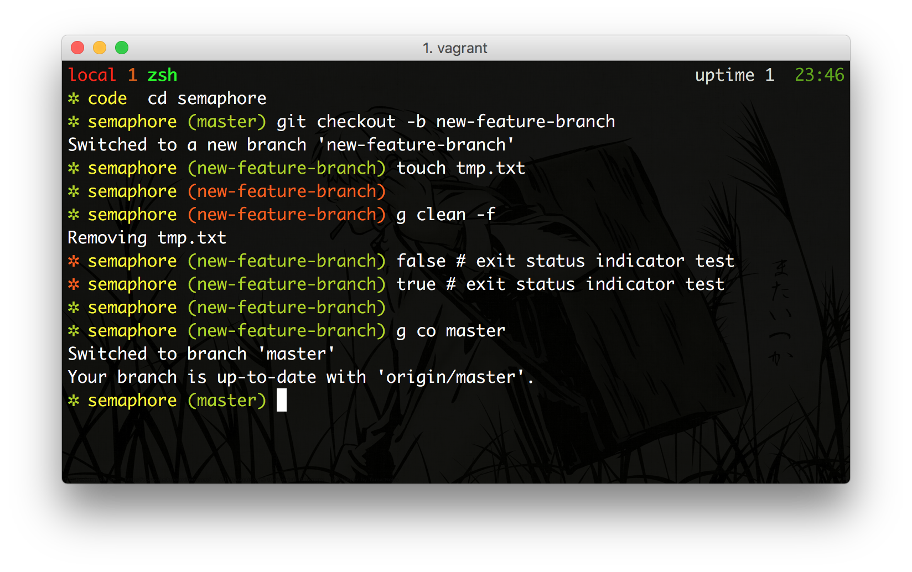
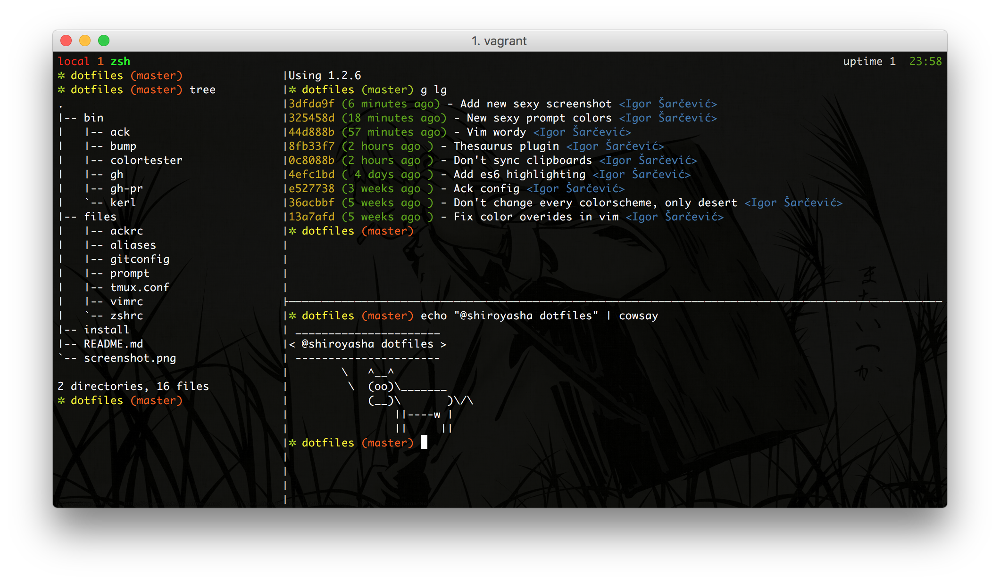

# Dotfiles

Simple, no bullshit, dotfiles.

### Nice colors (256 color based)

- Branch status indicator
- Exit status indicator
- Directory name indicator
- Branch name indicator



### Simple tmux based splits

Creating splits and windows:

- `Alt + w`: new window
- `Alt + s`: new vertical split
- `Alt + S`: new horizontal split

Movement:

- `Alt + hjkl`: split movement
- `Alt + u`: Move to window on the left
- `Alt + i`: Move to window on the right

Resizing:

- `Alt + <`: Resize panel to left
- `Alt + >`: Resize panel to right



## Installation

``` bash
git clone https://github.com/shiroyasha/dotfiles ~/dotfiles

cd ~/dotfiles

./install
```

For vim setup visit:

https://github.com/shiroyasha/neovimfiles

## Installing languages

ASDF:

```bash
git clone https://github.com/asdf-vm/asdf.git ~/.asdf --branch v0.12.0
```

Node:

``` bash
sudo apt-get install build-essential

asdf plugin add nodejs
asdf list all nodejs
asdf install nodejs 20.5.1
asdf global nodejs 20.5.1
```

Ruby:

``` bash
sudo apt-get install libz-dev
sudo apt-get install libyaml-dev

asdf plugin add ruby
asdf list all ruby | grep "3.2.0"
asdf install ruby 3.2.0
asdf global ruby 3.2.0

gem install bundler
gem update --system 3.4.18
```

## Export and import GPG keys

```
gpg --list-keys
```

```
gpg --export-private-key -i <id> > private.key
```

```
gpg --import private.key
```
